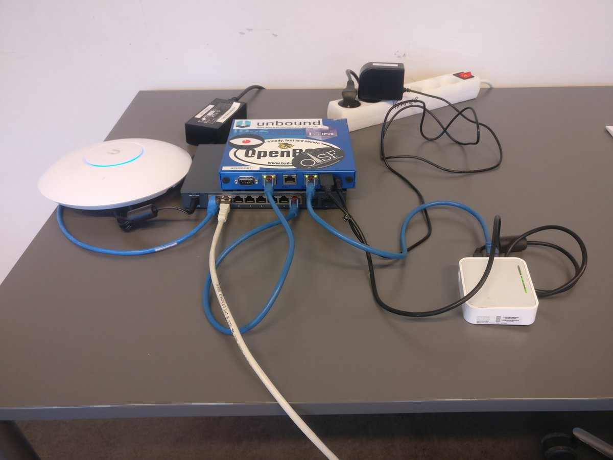
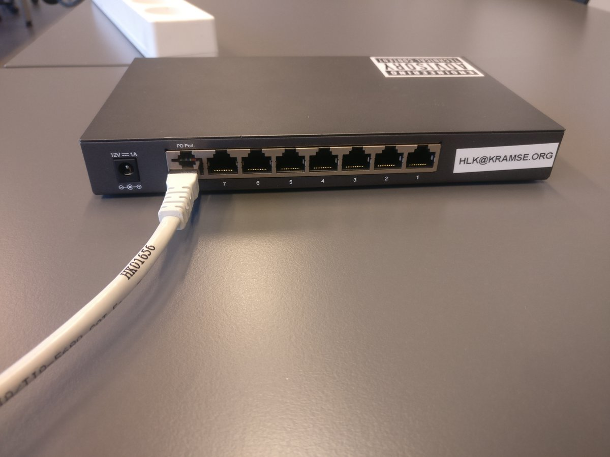

# Lab network setup

My current lab network used in trainings is very small.

I can bring this along and easily get a private - owned by me, sniffable, configurable, breakable network running.

## Hardware

I currently, 2019 use:
* Main router PC-Engines APU2C4 (APU2D4 model was updated by them)
* UniFi UAP Pro 2.4GHz and 5GHz AP
* "Core switch" TP-Link T1500G-10PS - PoE for the AP
* Smaller switch for students TP-Link T1500G-8T powered by PoE

Usually the uplink is Ethernet from the site I am visiting, but I also bring a small TP-Link TL-MR3020 running as Wifi client for wireless uplink when there is no cable.

Core net:

Distribution switch for students - can be moved easily since only one cable goes in:

## Software

Switches run the TP-Link firmware, which never really gets updated, only does SSLv3 and TLS1.0 etc. So this is not an endorsement of TP-Link - they are cheap and light.

UniFi APs have their stock firmware from UBNT.com, updated by the controller software running on my laptop once in a while.

APU2C4 runs OpenBSD from [OpenBSD.org](http://www.openbsd.org). This includes:
* OpenBSD PF firewall and NAT
* Unbound recursive name server
* built-in DHCPD
